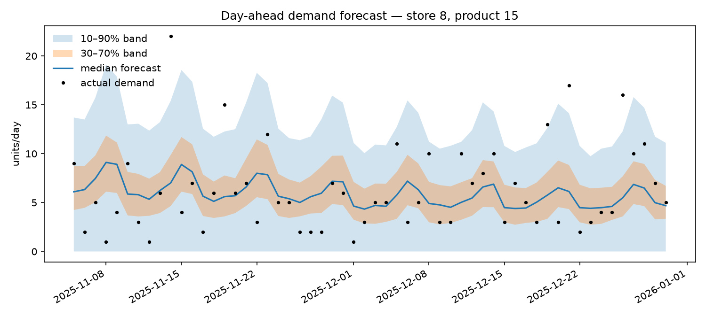
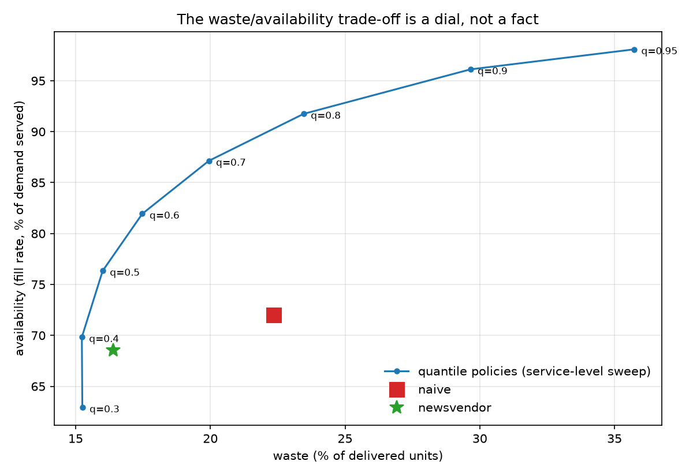

# forecast-to-order

**From probabilistic demand forecasts to shelf-ready orders — and the waste/availability trade-off in between.**

**▶ Live demo: [forecast-to-order.streamlit.app](https://forecast-to-order.streamlit.app)** — drag the service-level dial and watch the network replay under the policy you chose.

A forecast has no value until a decision consumes it. This repo implements the full loop for fresh-retail store ordering, end to end and fully reproducible on a laptop in under a minute:

```
synthetic fresh-retail data  →  quantile demand forecasts  →  newsvendor order decisions
        (negative binomial,        (gradient-boosted trees,       (critical ratio, pack-size
   weekday/season/weather/promo)    pinball loss, 11 quantiles)     rounding, order-up-to)
                                            ↓
                        daily replay simulation: fill rate vs waste vs profit
                                            ↓
                        per-order-line explanations for store staff
```

The core argument: **for perishable replenishment, the point forecast is the wrong product.** The expected-profit-maximizing order is a *quantile* of the demand distribution (the newsvendor critical ratio), and *which* quantile is a business dial — waste versus availability — not a modeling choice. A point forecast silently locks you to one point on that curve; a probabilistic forecast lets each retailer pick theirs.

## Results

84-day holdout, 360 store×product series, day-ahead forecasts (all numbers reproduce with `python scripts/run_demo.py`, fixed seeds).

### Forecast quality

| model | mean pinball ↓ | wMAPE (q50) ↓ | wMAPE, promo days ↓ | MedMAPE ↓ | 80% interval coverage |
|---|---|---|---|---|---|
| quantile GBM | **1.18** | **52.7%** | **52.5%** | **56.2%** | 0.88 |
| seasonal naive (per store×product×weekday) | 1.21 | 53.9% | 62.7% | 57.7% | 0.85 |

On quiet days a well-built seasonal baseline is competitive — that is what real retail data looks like, and it is why the baseline is non-negotiable. The learned model earns its keep where the baseline is structurally blind: **on promotion days its error is 16% lower relative** (52.5% vs 62.7% wMAPE), and the same applies to weather-driven demand.



### Decision quality — where the distribution pays

Each policy is replayed day by day over the holdout: orders arrive next morning, stock is sold FIFO, expired units become waste.

| policy | fill rate | waste | profit vs naive |
|---|---|---|---|
| naive (order last week's same-day sales) | 72.0% | 22.4% | — |
| newsvendor (per-product critical ratio q\*) | 68.5% | **16.4%** | **+22%** |
| best fixed quantile (q=0.6) | 81.9% | 17.5% | **+32%** |
| q=0.95 (availability-first) | 98.1% | 35.7% | −59% |



Three findings worth pausing on:

1. **The naive policy is strictly dominated.** Every point on the quantile frontier with the same waste has ~5–10 pts more availability. The value comes from the *distribution*, not just a better point estimate.
2. **The single-period newsvendor is provably conservative here.** With 1–3 days of shelf life an unsold unit is not always wasted, so the effective overage cost is lower than `cost` and the profit-maximizing quantile (empirically q≈0.6) sits above the textbook critical ratio (≈0.3–0.5 for these margins). The simulation measures exactly the gap the closed-form model misses — see [MATH.md](MATH.md).
3. **The "right" policy is not a number, it's a dial.** A discounter and a premium chain will pick different points on this frontier. The system's job is to expose the dial and price both directions of the trade-off.

### Explanations for the humans who accept the orders

Store staff accept or override each order line; acceptance rate is a product metric. Every recommendation ships with a deterministic, auditable explanation built from the decision's actual inputs:

> Order 20 units of product 2 (meat) for store 4 on 2025-10-31. Demand forecast: most likely around 18 units, with an 80% range of 5 to 40. Each unmet unit forgoes 3.16 of margin while each wasted unit loses 4.94, so we cover demand up to its 39% quantile (15.4 units). The shortfall of 15.4 is rounded up to whole packs of 10, giving 20 units.

## Run it

```bash
uv venv && uv pip install -e ".[dev,app]"   # or: pip install -e ".[dev,app]"
.venv/bin/python scripts/run_demo.py        # ~30s on a laptop; writes outputs/
.venv/bin/python -m pytest                  # unit tests
.venv/bin/streamlit run app.py              # interactive store-manager view
```

`run_demo.py --help` exposes the world size (stores/products/days), the holdout length, and the number of printed explanations.

### Interactive UI

Live at **[forecast-to-order.streamlit.app](https://forecast-to-order.streamlit.app)** (first load trains the models, ~1 min; cached afterwards).

`app.py` is the store-manager view of the same pipeline: pick a store and a delivery day, read the proposed order sheet with a plain-language explanation per line, and — the point of the exercise — drag the **service-level dial** and watch the network's fill rate, waste and profit move along the frontier. Every position of the dial is a full replay simulation of the holdout, not an interpolation. Deployable as-is on Streamlit Community Cloud (`requirements.txt` is provided).

## Design notes

- **No leakage by construction.** Every lag feature is shifted so day-D features use only information closed at D−1, plus the day-ahead weather forecast (a deliberately noisy version of the truth) and the promo calendar, which are known in advance. A unit test asserts the alignment.
- **Quantile crossing is handled.** One GBM per quantile can produce crossing quantiles; predictions are sorted per row before use, so the inverse CDF read by the ordering layer is always monotone.
- **MedMAPE alongside wMAPE.** With a long tail of slow movers, a handful of erratic series dominates any mean-based headline metric; the median of per-series wMAPE is robust to them and answers "how good is the typical series".
- **The baseline is also the fallback.** A morning-deadline production system (orders must exist before stores open) needs an answer even when the model pipeline fails. The seasonal-naive quantile table is cheap, deterministic and always available — it is both the honesty check and the degraded mode.
- **Determinism everywhere.** Data generation, training and simulation are seeded; the demo is a reproducible experiment, not a lucky run.

## Honest limitations & where this goes next

- **Synthetic data.** The generator produces realistic *structure* (overdispersed counts, intermittent slow movers, promo/weather effects) but observed `sales` equal true demand. Real sales are censored by stockouts; correcting for that (e.g. fitting on stockout-free days, or EM-style demand un-censoring) is the first step on real data. The natural public benchmark to port this to is M5 (Walmart, FOODS categories).
- **Single-period newsvendor with a multi-period reality.** The sweep quantifies the mismatch; the principled fix is a lost-sales inventory model with shelf-life-aware overage costs, or simulation-based optimization of the target quantile per product.
- **Fixed lead time of 1 day, no supplier constraints** beyond pack size (no MOQ, no delivery calendar), no substitution/cannibalization between products.
- **Foundation time-series models** (Chronos, TimesFM) are natural zero-shot challengers for the forecast layer — the decision and simulation layers are model-agnostic by design, which is precisely the point of the architecture.
